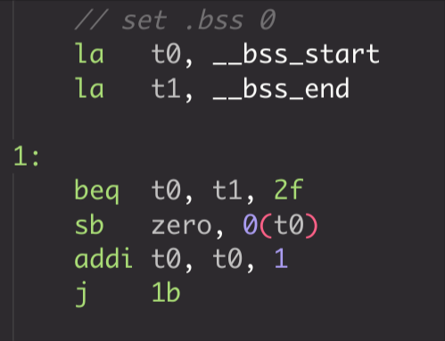
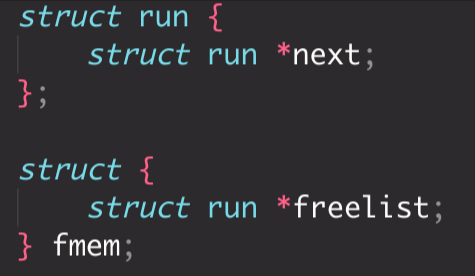
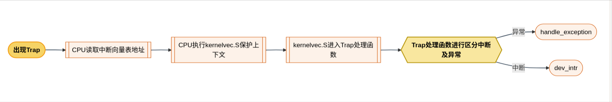
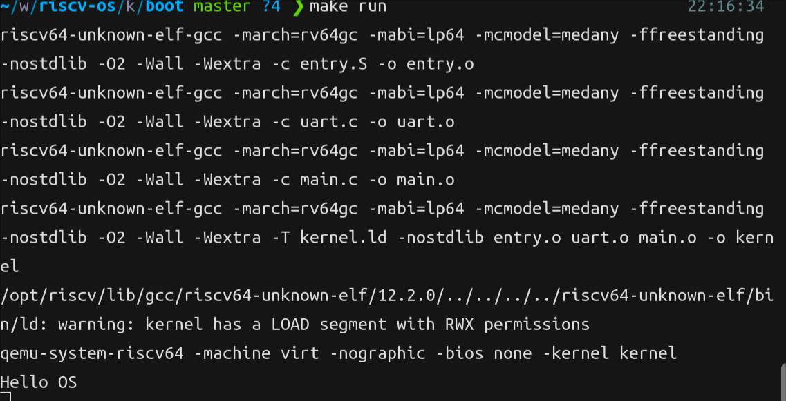
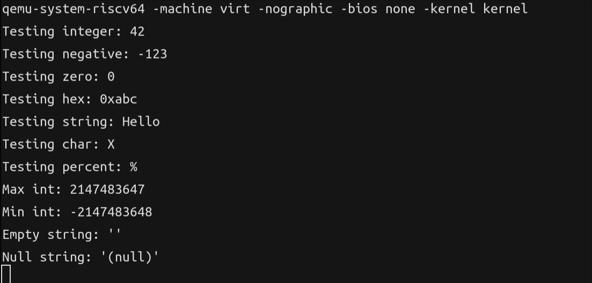
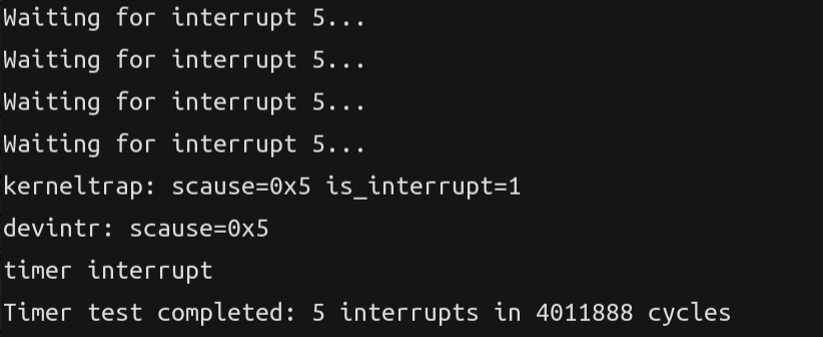
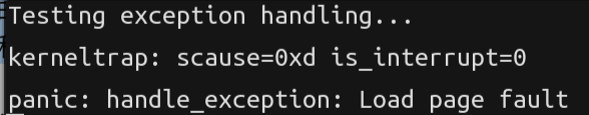

# 综合实验报告

## 系统设计部分

### 架构设计说明
系统整体架构仿照xv6实现，结合课程作业进行部分改动，主要分为两个层次：
1. **硬件层**：单核CPU，设备（磁盘、串口等）
2. **内核层**：进程管理;内存管理;文件系统;系统调用;设备驱动。

### 关键数据结构
### 与xv6对比分析

#### 实验一：
实验一实现最小启动，由于该实验仅要求单核，故与xv6主要在entry.S文件中不同。本实验无需考虑到多核的栈空间分配，直接分配一个栈即可。

#### 实验二：
实验二实现内核prinf与清屏。printf设计大体思路与xv6相同，新增对边界值的处理。

#### 实验三：
实验三实现内存的分配与页表管理系统。内存分配采用的数据结构与xv6相同，在虚拟内存的映射上会移除部分段的映射。

#### 设计决策理由

---

## 实验过程部分

### 实现步骤记录

#### 实验一：
实验一主要写entry.S,kernel.ld与uart.c这三个文件。流程图如下：

<div align="center">

</div>

实现步骤:
1. 实现entry.S。首先分配栈空间，这里仅考虑单核，采取直接分配4KB。然后进行bss段清0,在kernel.ld的链接脚本中定位到bss段的头和尾巴，在entry.S中将该段置0（如下图），最终call main。

<div align="center">

</div>

2. 实现kernel.ld。kernel.ld的设计参照xv6的布局，并提供了bss_start和bss_end供entry.S使用。
3. 实现uart.c。该实验主要要求实现写入字符和字符串，核心在于实现写入字符功能。参考xv6的uartputc_sync(int c)函数，主要定义THR，LSR和LSR_TX_IDLE三个量以及ReadReg和WriteReg两个宏。只有当上一次数据发送完毕才可以进行WriteReg，所以使用while((ReadReg(LSR) & LSR_TX_IDLE) == 0);来轮询检测缓冲区是否为空。为空即可使用WriteReg写入THR寄存器。

---

#### 实验二：
实验二主要实现console.c和print.c。从xv6中，我们可以看到输出格式化字符串的流程如图:

<div align="center">

</div>

实现步骤：

1. 实现console.c。console.c主要实现控制台输出，需要对uart.c中的uart_putc进行一个封装。由于uart只是串口，不知道删除是什么，所以我们需要对backspace键做一个处理。采用光标移动，然后使用空格覆盖掉字符，实现删除效果。
2. 实现print.c。print.c中目标需要实现printf函数。printf函数可实现对格式化字符串的输出，核心是对占位符的处理。为了方便处理，定义一个print_number函数，该函数可以按传入的进制输出number，同时处理负数的负号表示，定义一个printptr函数，该函数能实现对指针地址的输出处理。  
   - **对负号处理**：传入sign来声明是否为符号数。如果判断出sign 为真，并且num < 0，那么会对num取负数，然后在缓冲区中加入“-”。最终输出的时候相当于输出 “-” + 该负数的绝对值。对于**INT_MIN**进行了特殊处理，由于INT_MIN的绝对值会产生溢出，所以这里直接用类型转换，将INT_MIN使用无符号数解释，这样避免了溢出。  
   - **对进制处理**：定义一个digits数组，该数组包含0-f，用来处理十六进制及以下的进制。使用缓冲区进行迭代，每次循环中将符号处理好的数进行% base，最后buf中存放的就是倒序的对应进制表示。最后根据是否为负数来加负号，然后倒序输出buf。  
   - **对指针地址处理**：首先在控制台输出0x，然后遍历输出16进制数。对于目标ptr，每次遍历取最高4位转为16进制进行输出，遍历16次即可对64位地址进行输出。  
   - **对占位符处理**：判断%后面的参数是否满足占位符号。根据占位符号来调用print_number或printptr进行输出。其中使用<stdarg.h>里宏来访问可变参数。  

3. 清屏的实现：清屏实现较为简单，使用ANSI转义序列直接printf输出即可。

---

#### 实验三
实验三需要实现kalloc.c,vm.c。

实现步骤：

- **kalloc.c的实现步骤**
  1. 明确空闲内存分配的数据结构。由于分配内存块仅需对链表头部进行操作，他的增删复杂度均为O(1)，所以采用链表实现空闲内存块的管理。

  <div align="center">
  
  </div>

  2. 实现alloc_page：分配一个空闲块，只需要从链表表头获取该空闲块，然后从链表移除该空闲块即可。  
  3. 实现free_page：将不需要的内存块插入链表表头即可。  
  4. 实现内存块的初始化：获取RAM的起始地址与末尾地址，然后进行块对齐，将所有内存块构建出一个空闲块链表。

- **vm.c的实现步骤**
  1. 在vm.c中，我们重点实现walk函数（获取virtual address对应的pte），mappages函数（实现va到pa的映射），kernel_pagetable初始化（需要正确映射各个区段）。
  2. 实现walk函数。在这里我们采用了riscv的Sv39mode，只使用va的低39位。riscv规定使用三层索引结构。那么在walk函数中我么需要递归访问第0级索引获取目标的pte。使用for循环从第二层索引开始，重复以下步骤：获取对应层级索引的位置，通过移位来定位pte;获取对应pte所在的pa，然后访问对应pa所在的页表，重复以上操作直至到最终第0级索引，这里存储的pte即为最终pte。里面还有一个注意事项，参数alloc的使用。alloc是用来控制中间页的分配问题。当我们查询目的pte的时候，如果中间索引的页表不存在时，我们会根据alloc来判断是否需要分配中间索引的页表。这里主要在va到pa的映射使用分配中间页表，一般查找pte是否存在的话就无需分配。
  3. 实现mappages函数。该函数首先需要对参数进行一些检查，需要检查va，pa与size的对齐问题。然后从va和pa起始地方开始遍历，对于每一页，需要用walk获取pte的同时创建中间页表，故设置alloc为1。获取到pte后，会对pte指向的值进行处理，将PTE_V设置为1,同时对部分权限位进行按位或操作，组成一个完整的pte表项值u并存储。
  4. 实现虚拟内存映射初始化函数。该函数主要对内核的空间进行一个映射，由于不考虑用户侧的实现，仅需对pilc，uart0，virtio disk，text，data和free memory进行映射，同时给予对应的权限。

---

#### 实验四
实验四主要实现start.c、trap.c以及kernelvec.S。

实验步骤：
首先来看中断与异常的处理流程，如图所示：
  <div align="center">
  
  </div>

- **trap.c的实现步骤**
  1. 考虑trap的初始化问题。首先我们需要设计一个中断处理函数表：
  ```interrupt_handler_t interrupt_table[MAX_INTERRUPTS];```在初始化函数里，我们需要注册基本设备中断处理函数，然后将kernelvec地址放入stvec寄存器中，trap发生CPU可读取该寄存器地址并进入处理逻辑。
  2. trap.c中，我们需要实现kerneltrap函数，该函数为trap处理的入口，我们需要对trap的类型进行区分，通过**scause**的最高位，我们可以确定是发生了异常还是中断。
  3. 对于中断，我们需要读取scause的值，通过值来判断中断类型，对于设备类中断，需要调用对应的设备号的异常处理函数;对于时钟类中断，我们需要调用时钟处理函数(详见下文)。

- **kernelvec.S的实现步骤**
  1. kernelvec.S为trap的入口，CPU遇见trap会进入该汇编代码中。那么这段代码有两个作用：保存和恢复上下文，进入kerneltrap执行入口。
  2. 首先将当前 CPU 的临时寄存器、参数寄存器全都保存栈上。接着call kerneltrap，调用kerneltraph含素。执行完毕后，从栈上恢复这些寄存器。

- **start.c的实现步骤**
  1. start.c为xv6初始化入口，在entry.S中进入，他充当机器与内核main的桥梁。主要实现机器态到内核态的切换，并初始化时钟中断，最后进入mainh函数。
  2. 在该文件中，需要修改一系列相关的寄存器值，完成进入操作系统内核的必要转变。

- **时钟中断的实现步骤**
  1. 首先要在start.c中完成时钟的初始化，需要修改对应的寄存器值。设定时钟中断触发的基准值，CPU通过比较当前时间与设定时间的值，一旦出现大于情况，那么触发时钟中断。
  2. trap.c中每次触发时钟中断都需要设定下一个比较值，这样可以一直产生中断。
---

### 问题与解决方案

#### 实验一：
1. 无法清零bss段。我主要从汇编层面进行清0,通过定位到bss段，然后置0。
2. 程序无法启动。基地址设置错误，后重新定义。

#### 实验二：
1. 对INT_MIN绝对值溢出的处理。我采用无符号数来解释INT_MIN，这样不会溢出。

#### 实验三：
1. 在内核虚拟内存初始化的时候，kernel text始终无法映射。后检查原因，发现在链接脚本kernel.ld中没有对text段按照页对齐。
2. 内核虚拟内存初始化到kernel text时候，一直会panic，va大于MAXVA，这种情况一般不会出现。最后发现在mappages的for循环中，uint64与int相互转换出错了，将负数给扩展到非常大的值。

---

### 源码理解总结

#### 实验一：
1. 重点从xv6中理解了程序的运行过程，通过阅读entry.S了解了程序如何进入main函数。
2. 从uart.c文件中了解了部分宏的作用，重点学习了THR，LSR和LSR_TX_IDLE的核心用处。通过uartputc函数成功实现了自己的写入。

---

## 测试验证部分

### 功能测试结果

#### 实验一：
正确输出结果

#### 实验二：
正确输出结果

#### 实验三：
正确输出结果

#### 实验四：
正确输出结果
---

### 性能数据

#### 实验二：
使用while循环无限输出大量数据，没有造成崩溃。

---

### 异常测试

#### 实验二：
边界处理成功通过。

---

### 运行截图/录屏

#### 实验一：
<div align="center">

</div>

#### 实验二：
<div align="center">


</div>

#### 实验三：
<div align="center">

</div>

#### 实验四：
<div align="center">



